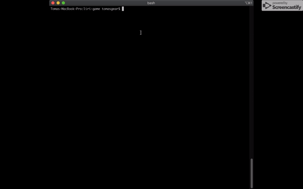
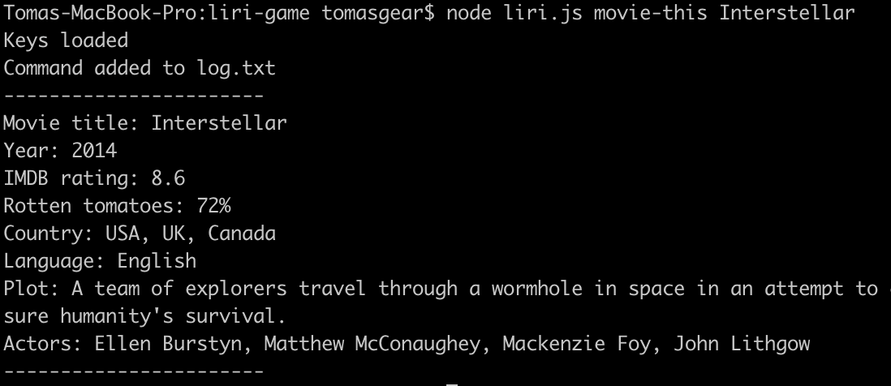
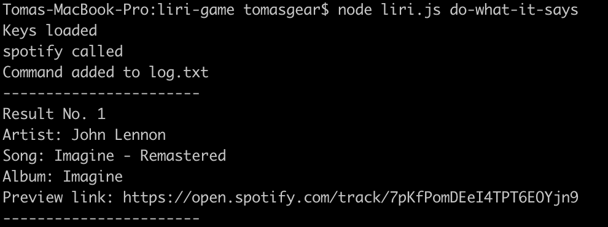

# Liri

Liri is a language interpretation and recognition interface that takes certain users commands as inputs and outputs results from those commands. 

## Getting Started

The instructions below will allow you to demo this project on your local machine. 

### Prerequisites

Have access to your terminal and basic familiarity with node.js

### Installing

After cloning to your local machine, run the following within the directory in your terminal: 

```
npm install 
node liri.js
```

## Running Liri 

Liri takes in four commands: 
- movie-this
- spotify-this-song
- concert-this 
- do-what-it-says 

The first three commands fetch results from the OMDB, Spotify, and Bands In Town APIs, respectively. Movie-this looks up movie data, like the release year, IMDB rating, actors, etc. Spotify-this-song looks up the song or artist on spotify and retrieves the artist(s), song name, album, and preview link to listen to the song. Concert-this retrieves the five latest concerts for an artist, including the venue name, location, and event date. The last command reads the text contained in line 1 of the random.txt file, which you are free to modify to any of the other commands. Please include a space after the comma. 

## Demo of Liri



View full demo [here] (https://drive.google.com/file/d/1dbI9DgJeZs4VrMy4rhxyFgCVH2aWcRiT/view). 

An example movie-this command would be: 

```
node liri.js movie-this Interstellar
```


The results for that command will appear as follows: 




Again, may use the same query structure in the example to run commands for artists whose concerts you'd like to see (concert-this), songs or artists who songs you'd like more information on (spotify-this-song), and general information about a movie (movie-this). 

```
node liri.js do-what-it-says
```
The default results for the above do-what-it-says command will appear as follows: 



Again, "it" here is really a reference to the command within the line 1 of random.txt file. You may modify it to run other commands as you please. 

## Built With

* [Node.js](https://nodejs.org/en/) - JavaScript runtime 
* [OMDB API](https://maven.apache.org/) - Used to fetch movie data
* [Spotify API](https://rometools.github.io/rome/) - Used to fetch music / song data
* [Bands in town API](https://rometools.github.io/rome/) - Used to fetch concert data
* [Moment.js](https://momentjs.com/) - Used to parse date / time data
* [Axios](https://www.npmjs.com/package/axios) - Used to make API calls 

## Author

* **Tomas Gear** - *https://github.com/nexio-t* - [Liri Repository](https://github.com/nexio-t/liri-game)

